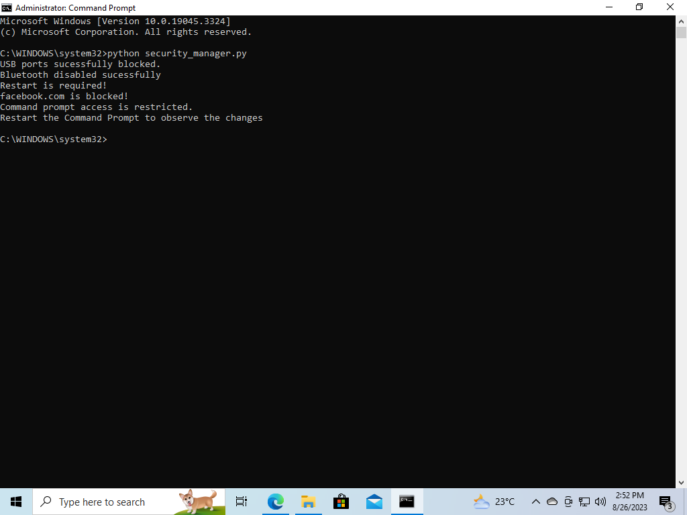

# Secureu-project
Interacting with the Windows Registry and implementing security measures on a Windows system with the help of python.

# Windows Security Measures 

# Author

- Author: G Mahananda Reddy

# Description

This script demonstrates interaction with the  Windows Registry to perform system-level modifications and implements security measures on a Windows system, including blocking USB ports, disabling Bluetooth, blocking access to a specific website, and restricting the command prompt.

## Installation

### Prerequisites

- Ensure that you are using a Windows 10 virtual machine a controlled environment for testing purposes.
- You need administrative privileges to modify the Windows Registry and execute the script.
- Even You need to run the .exe file with the administrative privileges

### Steps

1. **Download the Script:**
   - Download the script file, preferably to a location easily accessible on your system.

2. **Run the Script:**
   - Right-click on the script file and choose "Run as administrator". This ensures the script runs with the necessary administrative privileges.
   - For python file(.py) open command prompt with the adminstrative privileges navigate to file loacation and run the 'python security_manager.py' command.

3. **Script Execution:**
   - Once the script starts executing, you'll see output messages indicating the progress of each security measure being implemented.

4. **Observing the Effects:**
   - After the script completes execution, observe the following effects on your system:

     - **USB Storage Devices Blocking:**
       - USB storage devices will be disabled, preventing data transfer via USB ports.

     - **Bluetooth Disabling:**
       - Bluetooth functionality will be turned off, affecting wireless connectivity and peripherals.
       - Restart is required to affect this change.

     - **Website Blocking:**
       - Attempts to access the specified blocked website (e.g., www.facebook.com) will result in connection errors.

     - **Command Prompt Restriction:**
       - Command prompt access will be restricted, preventing its usage.
       - Attempt to open the Command Prompt will result in a message indicating restricted access.
       - Command prompt restart is required to affect this change.
       - try opening the Command Prompt by typing "cmd" in the Start menu or pressing Win + R and entering "cmd".You should receive a message stating that access to the Command Prompt has been restricted by the system administrator.

5. **Restart (if needed):**
    - If the script disables Bluetooth, a system restart might be required for the changes to take effect.

# Important Note

- This script modifies the Windows Registry, which can have unintended consequences if not used responsibly.
- It's crucial to test this script in a controlled environment, such as a virtual machine, where you can easily revert changes.
- Before running the script, make sure you understand the consequences and the implications this might have on your system's functionality.

# Usage

1. **Run with Administrative Privileges**: Make sure to run this script with administrative privileges to ensure the necessary access to modify the Windows Registry.
2. **Test on Windows 10 Virtual Machine**: It's recommended to test this script on a Windows 10 virtual machine.

## Script Execution

1. **Disable USB Ports**: The script will disable USB ports by modifying the Windows Registry. A message "USB ports successfully blocked." will be displayed upon completion.

2. **Disable Bluetooth**: The script will disable Bluetooth functionality by modifying the Windows Registry. A message "Bluetooth disabled successfully." will be displayed upon completion. Restart your system to apply this change.

3. **Block a Website**: The script will block access to a specific website by modifying the hosts file. A message "facebook.com is blocked!" will be displayed.

4. **Restrict Command Prompt**: The script will restrict access to the command prompt by modifying the Windows Registry. A message "Command prompt access is restricted." will be displayed.

# Testing

- It's recommended to test this script on a Windows 10 virtual machine to observe the effects of the implemented security measures without impacting your main system.

## Examples

## Disclaimer

**Use this script at your own risk. The author is not responsible for any unintended consequences or system disruptions caused by running the script.**

## Troubleshooting

- Disabling Bluetooth functionality through the Windows Registry within a virtual machine can be complex and may not yield the desired results due to virtualization layers.

1. Physical Hardware: However, the actual Bluetooth hardware on your machine might still be powered on until you manually turn it off. The physical state of the Bluetooth hardware is not immediately affected by the Registry change.

**In most cases, the Bluetooth functionality in a virtual machine is provided by the host machine's hardware. If you want to disable Bluetooth in the virtual machine, you might need to disable it on the host machine also**

# License

This script is provided for educational and informational purposes only. Use it responsibly and ensure that you comply with all relevant laws and regulations.

